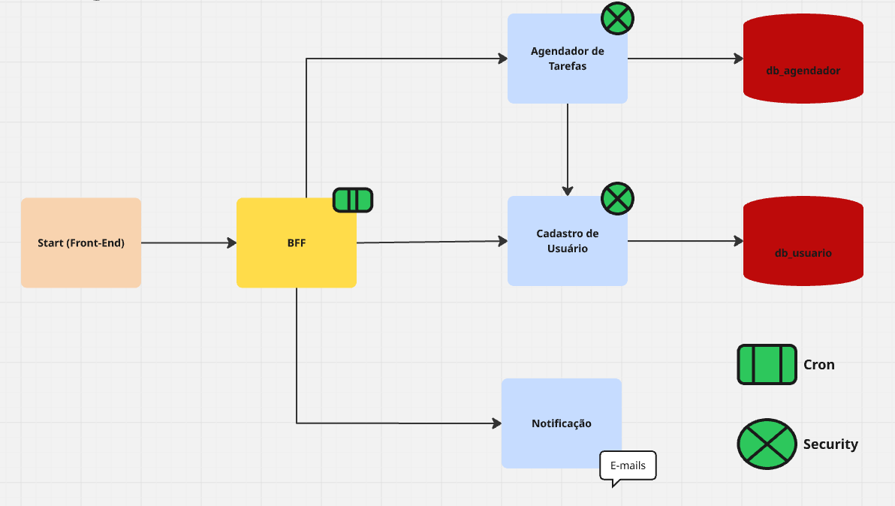

# Microserviço BFF - Agendador de Tarefas (bff-agendador)

---

### Contexto do Projeto

O **bff-agendador** é uma API REST desenvolvida em **Java com Spring Boot** e faz parte do projeto **Agendador de Tarefas**, construído com base em arquitetura de microserviços.

Este microserviço implementa o padrão **Backend for Frontend (BFF)**, atuando como camada intermediária entre os clientes (Web e Mobile) e os microserviços internos do sistema.

**Este microserviço é responsável por:**

- Centralizar a comunicação entre frontend e microserviços
- Orquestrar chamadas entre serviços
- Agregar dados de múltiplos microserviços
- Encaminhar requisições autenticadas
- Padronizar respostas enviadas aos clientes

O BFF atua como **porta de entrada da arquitetura**, reduzindo o acoplamento entre o frontend e os serviços de domínio.

O microserviço está **dockerizado**, permitindo execução isolada, portabilidade e fácil integração com os demais serviços.

---

### Arquitetura do Sistema

O sistema **Agendador de Tarefas** é composto por múltiplos microserviços especializados que trabalham de forma independente.

O bff-agendador atua como camada de **orquestração entre o cliente e os serviços internos da arquitetura**.

---

**Diagrama da Arquitetura**

  

### Descrição do Fluxo

1. Cliente realiza autenticação através do **ms-usuarios**.
2. **ms-usuarios** gera um token JWT.
3. Cliente envia requisições autenticadas para o **BFF**.
4. BFF encaminha requisições para os microserviços apropriados.
5. **ms-tarefas** gerencia e persiste as tarefas no **MongoDB**.
6. Quando necessário, o **BFF** ou o **ms-tarefas** aciona o **ms-notificacao**.
7. O **ms-notificacao** envia notificações por e-mail.

---

**Benefícios da arquitetura:**

- Separação clara de responsabilidades
- Redução do acoplamento entre frontend e microserviços
- Segurança centralizada
- Escalabilidade independente dos serviços
- Orquestração centralizada no BFF

---

#### Integração com OpenFeign

O BFF utiliza **OpenFeign** para comunicação declarativa entre microserviços.

**Essa abordagem garante:**

- Redução de código boilerplate
- Padronização de chamadas HTTP
- Facilidade na manutenção de endpoints remotos
- Comunicação simplificada entre serviços da arquitetura

O BFF se integra com os seguintes serviços:

- **ms-usuarios**
- **ms-tarefas**
- **ms-notificacao**

---

### Segurança

A autenticação do sistema é centralizada no **ms-usuarios**, utilizando **JWT (JSON Web Token)**.

**Principais mecanismos de segurança:**

- Autenticação baseada em JWT emitido pelo ms-usuarios
- Encaminhamento seguro do token entre microserviços
- Validação de requisições autenticadas
- Proteção de endpoints sensíveis

O BFF atua como intermediário, encaminhando o token JWT para os microserviços responsáveis pela validação da autenticação.

---

### Observabilidade

O microserviço utiliza **Spring Boot Actuator** para monitoramento e exposição de métricas operacionais.

**Endpoints disponíveis:**

- Healthcheck da aplicação
- Monitoramento de disponibilidade
- Exposição de métricas
- Informações do ambiente

**Exemplo de endpoint:**

    http://localhost:8083/actuator/health

A utilização do Actuator no BFF é especialmente relevante, pois ele atua como ponto central de entrada do sistema, permitindo monitorar a disponibilidade da camada de orquestração.

---

### API REST

O **bff-agendador** expõe endpoints REST **stateless**:

- Métodos HTTP: GET, POST, PUT, PATCH, DELETE
- Representação de recursos em JSON
- Comunicação HTTP com os microserviços internos

Os endpoints do BFF atuam como **camada de orquestração**, encaminhando requisições para os serviços apropriados.

---

### Documentação da API

A documentação da API está disponível via **Swagger**

    http://localhost:8083/swagger-ui.html

---

### Tecnologias Utilizadas

- Java 17
- Spring Boot
- Spring Web
- Spring Cloud OpenFeign
- Spring Boot Actuator
- Maven
- Docker

---

### Execução do Projeto

**Docker**

    docker compose down
   
    docker compose up --build

---

### Variáveis de Ambiente

Criar um arquivo `.env` na raiz do projeto contendo as seguintes variáveis.

| Variável | Descrição |
|--------|-----------|
| DB_USER | Usuário do banco de dados PostgreSQL |
| DB_PASSWORD | Senha do banco de dados PostgreSQL |
| USUARIO_EMAIL | Email utilizado para autenticação automática do sistema (Cron) |
| USUARIO_SENHA | Senha utilizada para autenticação automática do sistema (Cron) |
| USUARIO_API_PORT | Porta do microserviço **ms-usuarios** |
| AGENDADOR_API_PORT | Porta do microserviço **ms-tarefas** |
| NOTIFICACAO_API_PORT | Porta do microserviço **ms-notificacao** |
| BFF_API_PORT | Porta do microserviço **bff-agendador** |
| MAIL_USERNAME | Usuário SMTP para envio de e-mails |
| MAIL_PASSWORD | Senha SMTP |
| MAIL_HOST | Host do servidor SMTP |
| MAIL_PORT | Porta do servidor SMTP |

---

### Benefícios Arquiteturais

- Centralização da comunicação externa
- Orquestração entre microserviços
- Redução da complexidade no frontend
- Comunicação declarativa via OpenFeign
- Segurança baseada em JWT
- Escalabilidade independente
- Containerização com Docker
- Observabilidade integrada via Actuator

---

### Melhorias Futuras

- Implementação de estratégias de resiliência
- Circuit Breaker (Resilience4j)
- Integração com mensageria (RabbitMQ ou Kafka)
- Integração com Prometheus e Grafana
- Implementação de testes automatizados
- Deploy em ambiente Cloud

---

### Autor

**Geisivan Vitena**

LinkedIn:  
https://www.linkedin.com/in/geisivan-vitena-a46168246/
